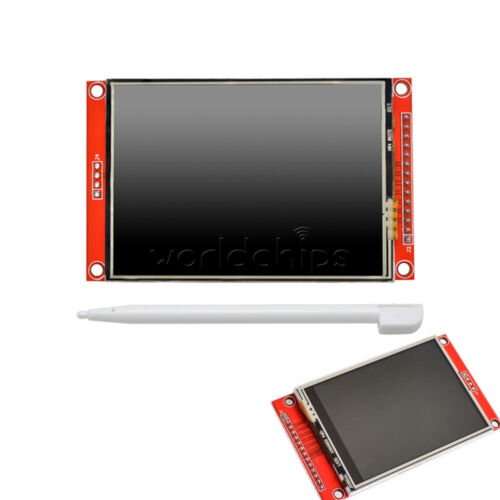

## Selecione o Idioma: | Português  | [Inglês](README_en.md) | [Espanhol](README_es.md)  |

## Observação
Este projeto apesar de possuir o README em três idiomas ele será sempre atualizado em português primeiro. 

# Minhas Bibliotecas de Arduino utilizadas.

# Adafruit_ILI9341

  - Installed in 23/01/2023
  - version: 1.0.5
